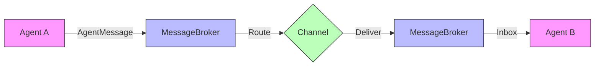

# Agents Protocol

A Python library for standardized communication between AI agents using a protocol-based system.

## Features

- **Standardized Message Format**: All agents communicate using a consistent `AgentMessage` structure
- **Multiple Communication Channels**: Support for local (in-process), HTTP, and WebSocket channels
- **Agent Registry**: Built-in registry for agent discovery and capability-based lookup
- **Request/Response Pattern**: Built-in support for synchronous request/response messaging
- **Async Support**: Fully async implementation for high-performance agent communication
- **Type Hints**: Complete type annotations for better IDE support
- **Extensible**: Easy to extend with custom message types, channels, and agent behaviors

## Installation

```bash
pip install agents-protocol
```

## Quick Start

### Basic Example

```python
import asyncio
from agents_protocol import (
    Agent, AgentMessage, MessageType, MessageBroker, LocalChannel
)

# Create a message broker
broker = MessageBroker()

# Create a local channel
channel = LocalChannel(broker)

# Create two agents
class EchoAgent(Agent):
    async def handle_request(self, message: AgentMessage) -> dict:
        """Echo back the received content."""
        return {"echo": message.content}

agent1 = EchoAgent(
    agent_id="agent1",
    name="Echo Agent",
    capabilities=["echo"]
)

agent2 = EchoAgent(
    agent_id="agent2",
    name="Echo Agent 2",
    capabilities=["echo"]
)

async def main():
    # Connect agents to broker
    await agent1.connect(broker)
    await agent2.connect(broker)

    # Start the channel
    await channel.start()

    # Send a message from agent1 to agent2
    message = AgentMessage(
        type=MessageType.REQUEST,
        sender_id="agent1",
        recipient_id="agent2",
        content={"text": "Hello, Agent2!"}
    )

    await agent1.send_message(message)

    # Wait for response
    response = await agent2.receive_message()
    if response:
        print(f"Agent2 received: {response.content}")

    # Clean up
    await agent1.disconnect()
    await agent2.disconnect()
    await channel.stop()

asyncio.run(main())
```

### Using the Agent Registry

```python
from agents_protocol import AgentRegistry, Agent

# Create registry
registry = AgentRegistry()

# Register agents
agent = Agent(
    agent_id="summarizer-1",
    name="Text Summarizer",
    capabilities=["summarization", "text-processing"]
)
registry.register(agent)

# Find agents by capability
summarizers = registry.find_by_capability("summarization")
print(f"Found {len(summarizers)} summarizer agents")
```

### Custom Agent with Handlers

```python
from agents_protocol import Agent, AgentMessage, MessageType

class CalculatorAgent(Agent):
    def __init__(self, agent_id: str, name: str):
        super().__init__(agent_id, name, capabilities=["math", "calculation"])
        # Register handler for request messages
        self.register_handler(MessageType.REQUEST, self.handle_request)

    async def handle_request(self, message: AgentMessage) -> dict:
        """Handle calculation requests."""
        operation = message.content.get("operation")
        a = message.content.get("a", 0)
        b = message.content.get("b", 0)

        if operation == "add":
            result = a + b
        elif operation == "multiply":
            result = a * b
        else:
            return {"error": f"Unknown operation: {operation}"}

        return {"result": result}
```

## Architecture

### Core Components

1. **AgentMessage**: The standardized message format that all agents use
2. **AgentProtocol**: Base interface that all agents must implement
3. **Agent**: Base class providing common agent functionality
4. **MessageBroker**: Central router for message delivery
5. **Channel**: Transport layer for message delivery (Local, HTTP, WebSocket)
6. **AgentRegistry**: Service discovery and capability indexing

### Message Flow



1. Agent A creates an `AgentMessage` and sends it via the broker
2. Broker routes the message through the configured channel
3. Channel delivers the message to Agent B's inbox
4. Agent B processes the message and optionally sends a response

## Configuration

### Using Different Channels

```python
from agents_protocol import MessageBroker, HTTPChannel, WebSocketChannel

# HTTP channel for cross-machine communication
broker = MessageBroker()
http_channel = HTTPChannel(broker, host="0.0.0.0", port=8080)
await http_channel.start()

# WebSocket channel for real-time streaming
ws_channel = WebSocketChannel(broker, host="0.0.0.0", port=8081)
await ws_channel.start()
```

## Development

### Setup Development Environment

```bash
# Clone the repository
git clone https://github.com/yourusername/agents_protocol.git
cd agents_protocol

# Create virtual environment
python -m venv venv
source venv/bin/activate  # On Windows: venv\Scripts\activate

# Install dependencies
pip install -e ".[dev]"

# Run tests
pytest tests/

# Format code
black src tests
ruff src tests
```

### Project Structure

```
agents_protocol/
├── src/agents_protocol/
│   ├── __init__.py
│   ├── protocol.py      # Core protocol definitions
│   ├── agents.py        # Agent base classes and registry
│   ├── messaging.py     # Message broker and routing
│   ├── channels.py      # Communication channels
│   └── version.py
├── tests/
├── pyproject.toml
├── README.md
└── LICENSE
```

## API Reference

### AgentMessage

```python
class AgentMessage(BaseModel):
    id: str                          # Unique message ID
    type: MessageType                # REQUEST, RESPONSE, NOTIFICATION, ERROR, HEARTBEAT
    sender_id: str                   # Who sent it
    recipient_id: Optional[str]      # Who receives it (None for broadcast)
    priority: MessagePriority        # LOW, NORMAL, HIGH, CRITICAL
    status: MessageStatus            # PENDING, SENT, DELIVERED, PROCESSING, COMPLETED, FAILED, TIMEOUT
    timestamp: datetime              # When it was sent
    correlation_id: str              # For request/response tracking
    reply_to: Optional[str]          # Message ID this is replying to
    content: Dict[str, Any]          # The actual message content
    metadata: Dict[str, Any]         # Additional metadata
```

### Agent

```python
class Agent(AgentProtocol):
    async def send_message(message: AgentMessage) -> AgentMessage
    async def receive_message() -> Optional[AgentMessage]
    async def broadcast(message: AgentMessage) -> None
    def get_agent_id() -> str
    def register_handler(message_type: MessageType, handler: Callable) -> None
    async def connect(broker: MessageBroker) -> None
    async def disconnect() -> None
```

## License

MIT License - see LICENSE file for details.

## Contributing

Contributions are welcome! Please feel free to submit a Pull Request.